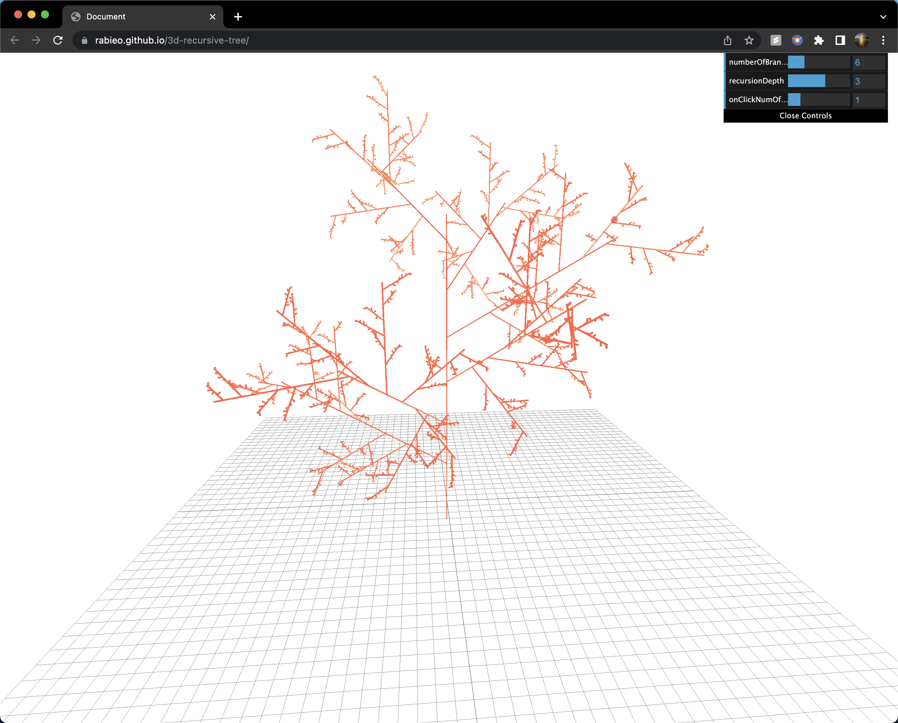

## About this project

Build a fractal-like pine tree structure from 3d segments.

## Demo

To try it out go to https://rabieo.github.io/3d-recursive-tree/. This uses cylinders as a geometry for the branches. 

Also, you can try it with lines geometry instead of cylinder geometry for better performance here https://rabieo.github.io/3d-hello-world/. This one animates around the y-axis too!

## Warning

Do not set the recursion and number of branches too large or it may start to lag if the device does not have a strong gpu.

## How to run locally

Just clone or download this repo and open the index.html file

## Compatability

This will run on
- Windows
- MacOS
- IOS
- Android

Any device with a modern browser.
For best results use the latest verion of chrome

## Featrues

- Change the number of branches
- Change the recursion depth
- Add custom branches

## Libraries used

- Threejs
  - https://github.com/mrdoob/three.js/
  - library built on top of WebGL for 3d rendering.
- Threejs/OrbitalControls
  - https://github.com/mrdoob/three.js/blob/dev/examples/jsm/controls/ArcballControls.js
  - An official threejs helper library that allows you to control the camera.
- dat.gui
  - https://github.com/dataarts/dat.gui
  - Library created by google employees that allows you to easily create a simple user interface component that can change variables in your code.

